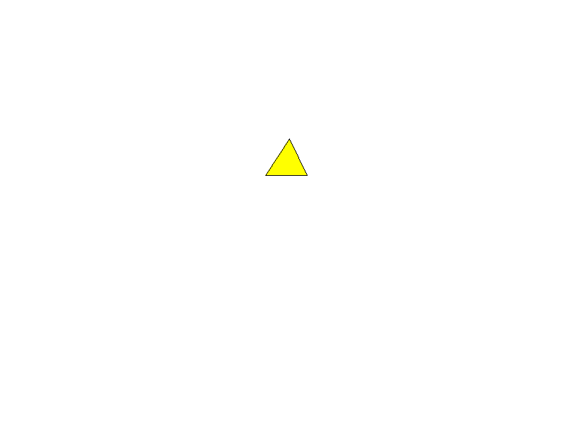

# Polygon Fill Lab — Polígono 3

## Propósito

Esta rama prueba de manera aislada el relleno y trazado del polígono 3, utilizando la infraestructura compartida de framebuffer, línea y relleno definida en `main`. `src/main.rs` en esta rama construye únicamente el polígono 3 y genera su evidencia visual por separado.

## Coordenadas y colores

Definidas en `src/polygons/polygon_3.rs`:

```
(377.0, 249.0) (411.0, 197.0) (436.0, 249.0)
```

- Color de relleno: `Color::YELLOW`
- Color de borde: `Color::BLACK`

## Algoritmos

- **Point-in-Polygon** con regla par-impar: para cada píxel candidato se cuenta cuántas veces un rayo horizontal desde su centro cruza los segmentos del polígono; un número impar de cruces indica que el punto está dentro.
- **Bounding box**: calculado a partir de los valores mínimos y máximos de `x` e `y` de los vértices, para limitar los píxeles evaluados durante el relleno.
- **Bresenham**: traza los segmentos de línea entre vértices consecutivos para dibujar el borde del polígono.
- **Framebuffer**: valida que las coordenadas estén dentro de los límites de la imagen antes de pintar cualquier píxel.

## Estructura

- `src/main.rs`: punto de entrada de esta rama. Crea el framebuffer, construye el polígono 3, ejecuta su relleno y el trazado de su borde, y exporta el resultado a `evidence/polygon-3.png`.
- `src/polygons/polygon_3.rs`: define la función que construye el `Polygon` del polígono 3 con sus vértices y colores.
- `src/polygon.rs`: define la estructura `Polygon` (vértices, color de relleno, color de borde, agujeros) y el método `draw_border`, que traza el contorno mediante `line()`.
- `src/polygon_fill.rs`: implementa `fill_polygon`, que calcula el bounding box y aplica la prueba Point-in-Polygon sobre cada píxel candidato.
- `src/line.rs`: implementa el algoritmo de Bresenham utilizado para dibujar los bordes.
- `src/framebuffer.rs`: encapsula la imagen de raylib; expone `point()` con validación de límites, `clear()` y `render_to_file()`.

## Ejecución

```bash
cargo run
```

Esta rama genera el archivo de evidencia:

```text
evidence/polygon-3.png
```

## Evidencia



## Integración

Esta rama sirve como evidencia independiente del desarrollo del polígono 3. El resultado con todos los polígonos integrados, incluyendo la generación de `out.png`, se encuentra en `main`.
