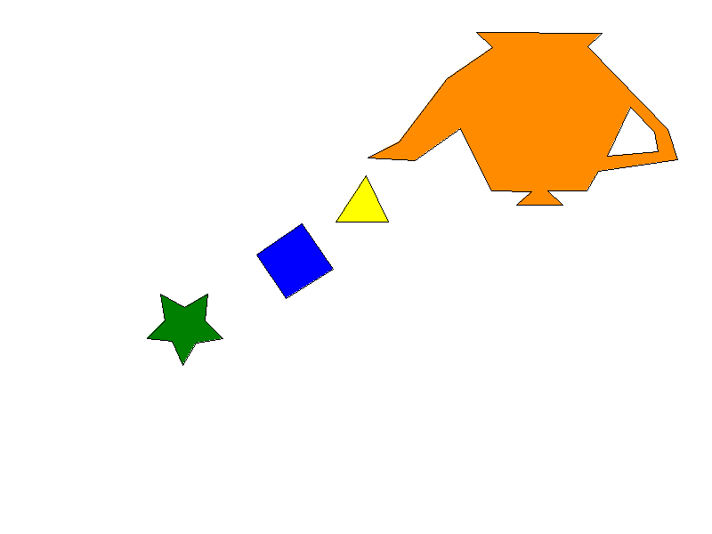

# Polygon Fill Lab

## Descripción

Polygon Fill Lab es un laboratorio de gráficas por computadora desarrollado en Rust utilizando la librería raylib. El proyecto implementa el relleno de polígonos definidos mediante conjuntos de coordenadas, dibujados sobre un framebuffer propio y exportados como una imagen final.

## Objetivo

El propósito del proyecto fue implementar una solución reutilizable capaz de:

- rellenar polígonos convexos y cóncavos;
- aceptar diferentes cantidades de vértices;
- dibujar sus bordes;
- manejar un agujero dentro de otro polígono;
- exportar el resultado final como `out.png`.

## Algoritmos utilizados

El relleno de cada polígono se realiza mediante **Point-in-Polygon** con la regla par-impar (*even-odd rule*): para cada píxel candidato se lanza un rayo horizontal desde su centro y se cuenta cuántas veces cruza los segmentos del polígono; un número impar de cruces indica que el punto está dentro.

Para evitar recorrer toda la imagen, primero se calcula un **bounding box** a partir de los valores mínimos y máximos de `x` e `y` de los vértices del polígono, y solo se evalúan los píxeles contenidos en ese rectángulo.

Cuando un polígono tiene agujeros, cada píxel candidato también se evalúa contra los vértices de cada agujero con la misma regla par-impar. Un píxel solo se pinta si se cumple la condición:

```
dentro_del_poligono && !dentro_de_un_agujero
```

Es decir, el centro del píxel debe estar dentro del contorno exterior del polígono y, al mismo tiempo, fuera de todos los contornos definidos como agujero.

Los bordes de los polígonos se dibujan con el **algoritmo de Bresenham**, que traza líneas rectas entre vértices consecutivos usando únicamente aritmética entera.

Tanto el relleno como el trazo de bordes escriben píxeles a través del framebuffer, que valida que las coordenadas estén dentro de los límites de la imagen antes de pintarlas, evitando accesos fuera de rango.

## Arquitectura del proyecto

- **`src/main.rs`**: punto de entrada. Crea el framebuffer, construye los cinco polígonos, agrega el polígono 5 como agujero del polígono 4, ejecuta el relleno y el dibujo de bordes de los polígonos 1 a 4, y exporta el resultado a `out.png`.
- **`src/framebuffer.rs`**: encapsula una `Image` de raylib. Gestiona el color de fondo y el color activo, expone `point()` para pintar un píxel individual con validación de límites, `clear()` para reiniciar el fondo y `render_to_file()` para exportar la imagen.
- **`src/line.rs`**: implementa el algoritmo de Bresenham para trazar una línea recta entre dos puntos sobre el framebuffer.
- **`src/polygon.rs`**: define la estructura `Polygon` y su comportamiento: construcción, registro de agujeros y dibujo del borde del contorno exterior y de cada agujero mediante `line()`.
- **`src/polygon_fill.rs`**: contiene la lógica de relleno (`fill_polygon`) y la prueba de punto-en-polígono (`point_is_inside`) usada tanto para el contorno exterior como para los agujeros.
- **`src/polygons/mod.rs`**: declara los módulos de cada polígono individual (`polygon_1` a `polygon_5_hole`).
- **`src/polygons/polygon_1.rs` a `polygon_4.rs`**: cada uno define una función que construye y devuelve una instancia de `Polygon` con sus propios vértices, color de relleno y color de borde.
- **`src/polygons/polygon_5_hole.rs`**: define una función que devuelve únicamente un conjunto de vértices (`Vec<Vector2>`), sin colores propios, pensado para usarse como agujero de otro polígono.

### Estructura del repositorio

```
polygon-fill-lab/
├── Cargo.lock
├── Cargo.toml
├── README.md
├── out.png
├── evidence/
│   ├── polygon-1.png
│   ├── polygon-2.png
│   ├── polygon-3.png
│   ├── polygon-4.png
│   └── polygon-5-hole.png
└── src/
    ├── main.rs
    ├── framebuffer.rs
    ├── line.rs
    ├── polygon.rs
    ├── polygon_fill.rs
    └── polygons/
        ├── mod.rs
        ├── polygon_1.rs
        ├── polygon_2.rs
        ├── polygon_3.rs
        ├── polygon_4.rs
        └── polygon_5_hole.rs
```

## Modelo reutilizable

El tipo central del proyecto es `Polygon`, definido en `src/polygon.rs`:

- `vertices`: lista de vértices (`Vec<Vector2>`) que define el contorno exterior del polígono, en el orden en que deben conectarse.
- `fill_color`: color con el que se rellena el interior del polígono.
- `border_color`: color con el que se traza el contorno.
- `holes`: lista de agujeros (`Vec<Vec<Vector2>>`), donde cada agujero es un conjunto independiente de vértices que se excluye del relleno.

Este modelo permite reutilizar la misma lógica de relleno y trazado de bordes para cualquier polígono, sin importar su número de vértices o si es convexo o cóncavo.

El polígono 5 (`polygon_5_hole`) no se construye como un `Polygon` independiente ni se rellena ni se bordea por sí solo: sus vértices se agregan mediante `add_hole` al polígono 4, funcionando exclusivamente como el agujero de esa figura.

## Procedimiento de desarrollo

El desarrollo siguió un flujo incremental basado en ramas:

1. Creación del repositorio y configuración inicial del proyecto en Rust.
2. Implementación en `main` de la infraestructura compartida: framebuffer, trazado de líneas, estructura `Polygon` y algoritmo de relleno.
3. Creación de una rama independiente por cada polígono (`feature/polygon-1` a `feature/polygon-5-hole`), partiendo de esa infraestructura común.
4. Generación, en cada rama, de una evidencia visual propia del polígono correspondiente.
5. Recuperación controlada de los módulos de cada polígono y de sus evidencias hacia `main`.
6. Integración de todos los polígonos en `main.rs`, incluyendo la asignación del polígono 5 como agujero del polígono 4.
7. Generación del archivo final `out.png` con el conjunto completo de polígonos rellenos y sus bordes.

## Estrategia de ramas

- `main`: infraestructura compartida (framebuffer, líneas, relleno, estructura `Polygon`) e integración final de todos los polígonos.
- `feature/polygon-1`: implementación y evidencia del polígono 1.
- `feature/polygon-2`: implementación y evidencia del polígono 2.
- `feature/polygon-3`: implementación y evidencia del polígono 3.
- `feature/polygon-4`: implementación y evidencia del polígono exterior 4.
- `feature/polygon-5-hole`: implementación del agujero dentro del polígono 4.

Las ramas de cada polígono se conservaron como evidencia independiente de su desarrollo individual. La integración final de todas las figuras en una sola escena se realizó en `main`.

## Requisitos

Según `Cargo.toml`, el proyecto usa la edición 2024 de Rust y depende de:

- `raylib` en su versión `6.0.0`, con la característica `SUPPORT_IMAGE_GENERATION` habilitada para permitir la generación y exportación de imágenes.

No se especifica en el proyecto una versión mínima de `rustc`, por lo que debe usarse un toolchain de Rust compatible con la edición 2024.

Al ser `raylib` un binding sobre la librería nativa de raylib, en Linux es necesario contar con un compilador de C y las herramientas de compilación habituales (como `cmake`) para que la librería nativa se compile correctamente durante `cargo build` o `cargo run`.

## Instalación y ejecución

```bash
git clone <URL_DEL_REPOSITORIO>
cd polygon-fill-lab
cargo run
```

Al ejecutar el proyecto se genera o actualiza el archivo:

```text
out.png
```

## Evidencias

El directorio `evidence/` contiene las salidas visuales individuales generadas durante el desarrollo de cada polígono en su rama correspondiente:

- `evidence/polygon-1.png`
- `evidence/polygon-2.png`
- `evidence/polygon-3.png`
- `evidence/polygon-4.png`
- `evidence/polygon-5-hole.png`

## Resultado final

El archivo `out.png`, generado por `main.rs`, contiene:

- los polígonos 1, 2 y 3;
- el polígono exterior 4;
- el polígono 5 representado como agujero dentro del polígono 4;
- los colores de relleno y de borde definidos por cada módulo en `src/polygons/`.



## Verificación

```bash
cargo fmt --check
cargo check
cargo run
```

## Exclusión de compilados

Según `.gitignore`, los directorios `target/` y `build/` no deben versionarse, ya que corresponden a artefactos de compilación. El archivo `Cargo.lock`, en cambio, sí forma parte del repositorio, dado que fija las versiones exactas de las dependencias utilizadas.

## Autor

```text
Nombre: [Nombre del estudiante]
```
