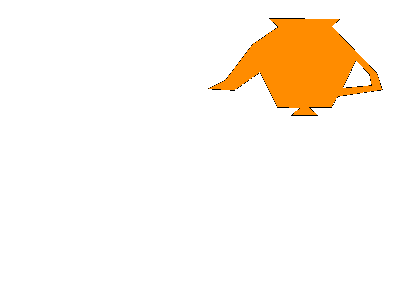

# Polygon Fill Lab — Agujero del polígono 4

## Propósito de la rama

Esta rama extiende el polígono exterior 4 agregando el polígono 5 como un agujero: una región interior que se excluye del relleno y por lo tanto no se pinta.

## Contorno exterior

Definido en `src/polygons/polygon_4.rs`:

```
(413.0, 177.0) (448.0, 159.0) (502.0, 88.0) (553.0, 53.0) (535.0, 36.0)
(676.0, 37.0) (660.0, 52.0) (750.0, 145.0) (761.0, 179.0) (672.0, 192.0)
(659.0, 214.0) (615.0, 214.0) (632.0, 230.0) (580.0, 230.0) (597.0, 215.0)
(552.0, 214.0) (517.0, 144.0) (466.0, 180.0)
```

- Color de relleno: `Color::new(255, 140, 0, 255)`
- Color de borde: `Color::BLACK`

## Agujero

Definido en `src/polygons/polygon_5_hole.rs`:

```
(682.0, 175.0) (708.0, 120.0) (735.0, 148.0) (739.0, 170.0)
```

Esta función devuelve únicamente un conjunto de vértices (`Vec<Vector2>`), sin colores propios, ya que no representa un polígono independiente.

## Manejo del agujero

Un píxel candidato se pinta solo si cumple la condición conceptual:

```text
dentro_del_poligono_exterior && !dentro_del_agujero
```

Es decir, el centro del píxel debe estar dentro del contorno del polígono 4 y, al mismo tiempo, fuera del contorno del agujero.

El agujero se almacena en el campo `holes` (`Vec<Vec<Vector2>>`) de la estructura `Polygon`, definida en `src/polygon.rs`. Se incorpora mediante el método `add_hole`, que solo acepta el agujero si tiene al menos 3 vértices.

## Orden de renderizado

Según `src/main.rs`:

1. Creación del polígono exterior 4 mediante `polygon_4()`.
2. Incorporación del agujero mediante `polygon.add_hole(polygon_5_hole())`.
3. Relleno del polígono con `fill_polygon`, que evalúa cada píxel candidato dentro del bounding box del contorno exterior y excluye los que caen dentro del agujero.
4. Dibujo de los bordes con `polygon.draw_border`, que traza tanto el contorno exterior como el contorno del agujero mediante el algoritmo de Bresenham (`src/line.rs`).
5. Exportación de la evidencia mediante `framebuffer.render_to_file`.

Tanto el relleno como el trazado de bordes escriben píxeles a través del framebuffer (`src/framebuffer.rs`), que valida los límites de la imagen antes de pintar cualquier punto.

## Ejecución

```bash
cargo run
```

Esta rama genera el archivo de evidencia:

```text
evidence/polygon-5-hole.png
```

## Evidencia



## Relación con main

Esta rama conserva la prueba aislada del agujero del polígono 4. La integración total de los cinco polígonos, junto con la generación de `out.png`, se encuentra en `main`.
