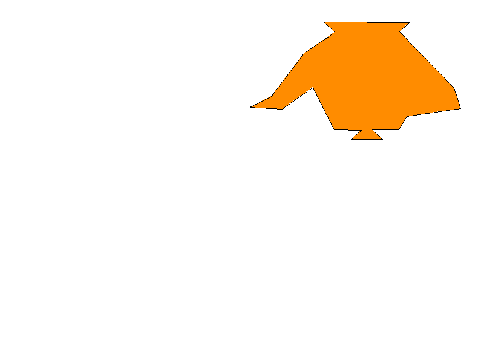

# Polygon Fill Lab — Polígono exterior 4

## Propósito de la rama

Esta rama implementa y prueba únicamente el contorno exterior del polígono 4, utilizando la infraestructura compartida de framebuffer, línea y relleno definida en `main`. `src/main.rs` en esta rama construye únicamente el polígono 4 y genera su evidencia visual por separado.

## Coordenadas y colores

Definidas en `src/polygons/polygon_4.rs`:

```
(413.0, 177.0) (448.0, 159.0) (502.0, 88.0) (553.0, 53.0) (535.0, 36.0)
(676.0, 37.0) (660.0, 52.0) (750.0, 145.0) (761.0, 179.0) (672.0, 192.0)
(659.0, 214.0) (615.0, 214.0) (632.0, 230.0) (580.0, 230.0) (597.0, 215.0)
(552.0, 214.0) (517.0, 144.0) (466.0, 180.0)
```

- Color de relleno: `Color::new(255, 140, 0, 255)`
- Color de borde: `Color::BLACK`

## Características de la figura

El polígono está definido por 18 vértices que forman un contorno cóncavo, con varios cambios de dirección entrantes y salientes entre sus segmentos. Esto lo distingue de los polígonos convexos más simples de otras ramas y ejercita el algoritmo de relleno sobre una figura compleja.

## Algoritmos utilizados

- **Point-in-Polygon** con regla par-impar: para cada píxel candidato se cuenta cuántas veces un rayo horizontal desde su centro cruza los segmentos del polígono; un número impar de cruces indica que el punto está dentro.
- **Bounding box**: calculado a partir de los valores mínimos y máximos de `x` e `y` de los vértices, para limitar los píxeles evaluados durante el relleno.
- **Bresenham**: traza los segmentos de línea entre vértices consecutivos para dibujar el borde del polígono.
- **Framebuffer**: valida que las coordenadas estén dentro de los límites de la imagen antes de pintar cualquier píxel.

## Archivos relevantes

- `src/main.rs`: punto de entrada de esta rama. Crea el framebuffer, construye el polígono 4, ejecuta su relleno y el trazado de su borde, y exporta el resultado a `evidence/polygon-4.png`.
- `src/polygons/polygon_4.rs`: define la función que construye el `Polygon` del polígono 4 con sus 18 vértices y colores.
- `src/polygon.rs`: define la estructura `Polygon` (vértices, color de relleno, color de borde, agujeros) y el método `draw_border`, que traza el contorno mediante `line()`.
- `src/polygon_fill.rs`: implementa `fill_polygon`, que calcula el bounding box y aplica la prueba Point-in-Polygon sobre cada píxel candidato.
- `src/line.rs`: implementa el algoritmo de Bresenham utilizado para dibujar los bordes.
- `src/framebuffer.rs`: encapsula la imagen de raylib; expone `point()` con validación de límites, `clear()` y `render_to_file()`.

## Ejecución

```bash
cargo run
```

Esta rama genera el archivo de evidencia:

```text
evidence/polygon-4.png
```

## Evidencia



## Limitación intencional de esta rama

En esta rama el polígono 4 se muestra completamente relleno, sin ningún agujero. El agujero interior se implementa de forma independiente en `feature/polygon-5-hole`.

## Integración final

La combinación de todos los polígonos, incluyendo la aplicación del agujero sobre el polígono 4 y la generación de `out.png`, se realiza en `main`.
